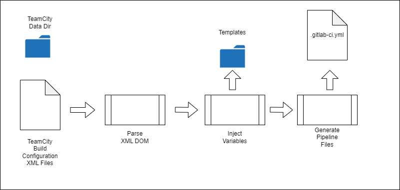

# Design

## Overview

The utility implements the following process:

* Load the TeamCity (XML) build configurations to be transformed from a data directory
* Convert the XML elements within the DOM to variables that can be used within a template for a GitLab pipeline yaml file
* Inject the variables into the template(s) and output the yaml files

